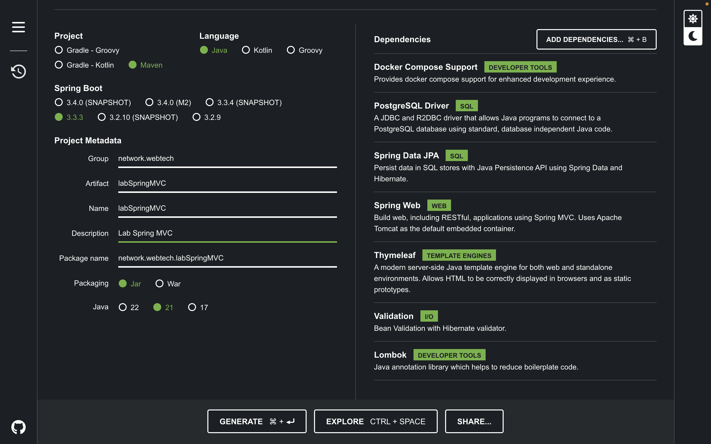

# Lab Spring MVC
***
### **Construção de uma aplicação full stack**
***
Este laboratório tem como objetivo apresentar e explorar conceitos fundamentais das seguintes tecnologias e práticas:

- Spring Framework e Spring MVC: Introduzindo a construção de aplicações web e a arquitetura Model-View-Controller.
- Banco de Dados com Docker: Demonstrando como configurar e gerenciar bancos de dados usando containers Docker.
- JPA (Java Persistence API): Abordando a persistência de dados em Java, com foco em mapeamento objeto-relacional.
- DTO (Data Transfer Object): Explicando o uso de objetos para transferir dados entre camadas de uma aplicação.
- Thymeleaf: Mostrando como usar este mecanismo de templates para criar e renderizar páginas web dinâmicas.
***
## Tecnologias utilizadas
**Linguagens, Frameworks e Bibliotecas utilizadas na construção do projeto.**

<div style="display: flex; gap: 30px;">
  
  
  
  
</div>

***
## Etapa 1: Inicialização do projeto com o Spring Initializr

1. **Descrição**: Utilizar o [Spring Initializr](https://start.spring.io/) para gerar os arquivos de projeto básico (boilerplate).
2. **Conhecimentos Fundamentais**: Spring Framework, Spring Boot, MVC pattern.
3. **Produto Esperado**: Estrutura de projeto Spring Boot configurada com pacotes separados para controllers, models, views, repositories e services.

**Descrição:** Nesta etapa, vamos utilizar o Spring Initializr para gerar os arquivos de projeto básico (boilerplate) para a nossa aplicação Spring Boot. O Spring Initializr é uma ferramenta online que simplifica o processo de inicialização de projetos Spring Boot, permitindo-nos selecionar as dependências necessárias e configurar o projeto de acordo com nossas necessidades.

**Conhecimentos Fundamentais:**

- Spring Framework: Conjunto de bibliotecas que facilitam o desenvolvimento de aplicações Java empresariais.
- Spring Boot: Framework baseado no Spring Framework que simplifica o processo de configuração e desenvolvimento de aplicações Spring.
- MVC pattern: Padrão de arquitetura de software que separa os componentes de uma aplicação em Model, View e Controller.

**Produto Esperado:**
Estrutura de projeto Spring Boot configurada com pacotes separados para controllers, models, views, repositories e services.

---

#### Passo a Passo:

1. Acesse o [Spring Initializr](https://start.spring.io/).
2. Configure o projeto selecionando as seguintes opções:
    - **Project:** Maven Project
    - **Language:** Java
    - **Spring Boot:** Escolha a versão mais recente disponível.
    - **Project Metadata:** Preencha o Group, Artifact e Name conforme desejar.
    - **Dependencies:** Selecione as dependências necessárias para o seu projeto, como Spring Web para MVC.
3. Clique em "Generate" para baixar o arquivo ZIP contendo o projeto gerado pelo Spring Initializr.
4. Extraia o conteúdo do arquivo ZIP em um diretório de sua escolha.
5. Abra o projeto em sua IDE de desenvolvimento Java (Eclipse, IntelliJ, etc.).



### Dependências a serem adicionadas:
- **PostgreSQL Driver**: Driver para conectar sua aplicação ao banco de dados PostgreSQL. [Documentação do PostgreSQL Driver](https://jdbc.postgresql.org/documentation/).
- **Spring Data JPA**: Biblioteca para integração com bancos de dados utilizando JPA (Java Persistence API). [Documentação do Spring Data JPA](https://spring.io/projects/spring-data-jpa).
- **Thymeleaf**: Motor de template para renderizar páginas HTML dinâmicas. [Documentação do Thymeleaf](https://www.thymeleaf.org/documentation.html).
- **Spring Web**: Parte do Spring Framework para criar aplicações web e RESTful. [Documentação do Spring Web](https://spring.io/projects/spring-web).
- **Lombok**: Biblioteca para reduzir a boilerplate code no Java. [Documentação do Lombok](https://projectlombok.org/).
- **Validation**: Biblioteca para validação de dados em Java. [Documentação da Bean Validation](https://beanvalidation.org/documentation/).
- **Docker Compose Support**: Ferramenta para definir e executar aplicações multi-container Docker. [Documentação do Docker Compose](https://docs.docker.com/compose/).

***

### Criar um controller inicial:
***Criação da Pasta `controllers`***

Crie uma pasta chamada `controllers` no seguinte caminho:

`/lab-spring-mvc/src/main/java/network/webTech/labSpringMVC
`

Isso permitirá que você organize seus controladores de forma adequada dentro do projeto `lab-spring-mvc`.

##### Crie um controller chamado helloController
```java
package network.webTech.labSpringMVC.controllers;

import org.springframework.stereotype.Controller;
import org.springframework.ui.Model;
import org.springframework.web.bind.annotation.GetMapping;

@Controller
public class helloController {

   @GetMapping("/hello")
   public String hello(Model model) {
      model.addAttribute("message", "Hello World!");
      return "hello";
   }
}
```

### Criação da Página HTML `hello`
Agora, para visualizar a mensagem, vamos criar uma página HTML chamada `hello.html`.

Coloque o arquivo na pasta apropriada dentro do seu projeto, como por exemplo:
`/Users/pedrofelix/projetos/lab-spring-mvc/src/main/resources/templates/hello.html`

Essa página será usada para exibir a mensagem desejada.

```html
<!DOCTYPE html>
<html xmlns:th="http://www.thymeleaf.org">
<head>
    <meta charset="UTF-8">
    <title>Hello Page</title>
</head>
<body>

<div class="container">
    <div class="row justify-content-center">
        <div class="col-md-6 text-center">
            <h1 th:text="${message}"></h1>
        </div>
    </div>
</div>


</body>
</html>
```
### Explicações Importantes

#### `xmlns:th="http://www.thymeleaf.org"`

No exemplo acima, a linha `<html xmlns:th="http://www.thymeleaf.org">` define o namespace para o Thymeleaf, que é um mecanismo de template usado em aplicações Spring. Isso permite a utilização dos atributos do Thymeleaf, como `th:text`, para vincular dados do modelo aos elementos HTML de maneira dinâmica.

#### `${message}`

A expressão `${message}` dentro do atributo `th:text` é uma variável do modelo que será substituída pelo valor associado a ela no controlador. Essa variável é passada do backend para a página HTML, permitindo que o conteúdo da página seja dinâmico e baseado nos dados processados no servidor.

Por exemplo, no controlador Spring, você pode ter algo assim:


**Executar a aplicação:**
Para executar a aplicação Spring Boot, você pode usar o Maven para compilar e executar o projeto. Na raiz do projeto, execute o seguinte comando:


# Testando a Aplicação

Para testar a aplicação, siga estes passos:

1. **Inicie a aplicação** executando o comando abaixo no terminal:

    ```bash
    mvn spring-boot:run
    ```

   Este comando inicia o servidor Spring Boot e faz com que a aplicação esteja disponível localmente.

2. **Acesse a URL** abaixo no seu navegador para visualizar a página:

   [http://localhost:8080/hello](http://localhost:8080/hello)

   Você deverá ver a página `hello.html` renderizada com a mensagem configurada. Isso confirma que a aplicação está funcionando corretamente e que a página HTML está sendo exibida como esperado.


***


**Exemplo de Estrutura de Projeto:**

```
meu-projeto
│   ├── src
│   │   ├── main
│   │   │   ├── java
│   │   │   │   └── com
│   │   │   │       └── exemplo
│   │   │   │           ├── controllers
│   │   │   │           │   └── helloController.java
│   │   │   │           ├── dto
│   │   │   │           ├── erros
│   │   │   │           ├── models
│   │   │   │           ├── repositories
│   │   │   │           └── services
│   │   │   │               └── impl 
│   │   │   └── resources
│   │   │       ├── static
│   │   │       └── templates
│   │   └── test
│   │       └── java
│   └── pom.xml
```

Nesta estrutura de projeto, os pacotes estão organizados da seguinte forma:

- **controllers:** Contém as classes responsáveis por receber as requisições HTTP e direcioná-las para os serviços apropriados.
- **models:** Contém as classes que representam as entidades de negócio da aplicação.
- **repositories:** Contém as interfaces de repositório para acessar os dados do banco.
- **services:** Contém as classes de serviço responsáveis por implementar a lógica de negócio da aplicação.
- **dto(Data Transfer Objects:** Contém as classes usadas para transferir dados entre diferentes camadas da aplicação, como entre os controladores e serviços.
- **errors (ou exceptions):** Contém as classes e configurações relacionadas ao tratamento de erros e exceções na aplicação.

***

## Etapa 2: Configuração do Banco de Dados com Docker

### Descrição

Esta etapa configura o banco de dados PostgreSQL usando Docker. O Docker facilita o empacotamento e a execução de serviços em containers isolados, simplificando a configuração e a execução de ambientes de desenvolvimento e produção.

### Conhecimentos Fundamentais

- **Docker**: Tecnologia de contêinerização que permite empacotar, distribuir e executar aplicações em ambientes isolados.
- **Dockerfile e docker-compose**: Arquivos de configuração utilizados para definir a construção e a execução de containers Docker.

### Produto Esperado

Um ambiente de banco de dados PostgreSQL configurado e em execução dentro de um container Docker, acessível na porta 5432.

### Passo a Passo

1. **Configuração do Docker Compose**

   Crie um arquivo chamado `docker-compose.yaml` na raiz do seu projeto com o seguinte conteúdo:

   ```yaml
   version: '3.8'

   services:
     postgres:
       image: postgres:latest
       container_name: postgres-db
       environment:
         POSTGRES_DB: postgres
         POSTGRES_USER: postgres
         POSTGRES_PASSWORD: postgres
       ports:
         - "5432:5432"
       volumes:
         - postgres-data:/var/lib/postgresql/data
   ```
   
   #### Análises:
      -  version: '3.8' Define a versão do Docker Compose.
      - services: Define os serviços que serão executados.
      - postgres: Configuração do serviço PostgreSQL.
      - image: postgres:latest: Usa a imagem mais recente do PostgreSQL.
      - container_name: postgres-db: Nome do container.
      - environment: Variáveis de ambiente para configurar o banco de dados.
      - POSTGRES_DB: Nome do banco de dados a ser criado.
      - POSTGRES_USER: Nome do usuário do banco de dados.
      - POSTGRES_PASSWORD: Senha do usuário do banco de dados.
      - ports: Mapeia a porta do container para a porta local (5432).
      - volumes: Monta um volume nomeado para persistência de dados.
   


2. **Iniciar o Ambiente**
   Execute o seguinte comando na raiz do seu projeto para construir e iniciar o container em segundo plano:

   ```bash
   docker-compose up --build -d
   ```
   #### Análises:
   - docker-compose up: Este comando cria e inicia containers definidos no arquivo docker-compose.yaml. Se os containers já estiverem em execução, ele os reiniciará.
   - --build: Este parâmetro força o Docker a reconstruir a imagem, mesmo que não haja alterações no Dockerfile. Embora não seja necessário para a imagem do PostgreSQL (a não ser que você tenha modificado o Dockerfile), é útil para outros serviços que podem ter alterações.
   - -d: Este parâmetro executa os containers em segundo plano (modo detach), permitindo que o terminal seja liberado para outras tarefas enquanto os containers continuam funcionando.
   


3. **Verificar o Container**

   Após iniciar o ambiente, você pode verificar se o PostgreSQL está rodando corretamente com os seguintes comandos:

   Listar Containers em Execução:

   ```bash
    docker ps
   ```
   Verifique se o container postgres-db está listado e em execução.

***

## Etapa 3: Implementação de Entidades, conexão com banco e configuração do Thymeleaf

**Descrição:** Nesta etapa, vamos implementar controllers para lidar com as requisições voltadas para a obtenção de Views do padrão MVC e para acesso as operações CRUD. Utilizaremos o Spring Thymeleaf para criar controllers que suportem tanto views baseadas em templates quanto operaçoes de crud.

**Conhecimentos Fundamentais:**
- Spring Thymeleaf: Framework que facilita o desenvolvimento de aplicações web seguindo o padrão Model-View-Controller.

**Produto Esperado:**
Controllers implementados no Spring MVC, com suporte a views baseadas em templates utilizando Thymeleaf, e endpoints que fornecem interfaces para operações de CRUD sobre as entidades da aplicação.

---

#### Passo a Passo:

##### A.  **Configuração do Banco de Dados e Thymeleaf**

   1. **Configuração da Conexão com o Banco de Dados e organização do Thymeleaf**
      O projeto está configurado para se conectar a um banco de dados PostgreSQL. Certifique-se de que o banco de dados está configurado corretamente e que as credenciais de acesso estão corretas. As configurações de conexão são definidas no arquivo `application.properties`

      ```properties
      # Nome da Aplicação
      spring.application.name=labspringmvc
      
      # Configurações do Banco de Dados
      spring.datasource.url=jdbc:postgresql://localhost:5432/nome_do_banco
      spring.datasource.username=seu_usuario
      spring.datasource.password=sua_senha
      spring.datasource.driver-class-name=org.postgresql.Driver
      
      # Configurações do JPA/Hibernate
      spring.jpa.database-platform=org.hibernate.dialect.PostgreSQLDialect
      spring.jpa.hibernate.ddl-auto=update
      spring.jpa.show-sql=true
      
      # Configurações do Thymeleaf
      spring.thymeleaf.prefix=classpath:/templates/
      spring.thymeleaf.suffix=.html
      spring.thymeleaf.cache=false
      ```

      ##### **Explicação das Configurações**
         - spring.application.name: Nome da aplicação.
         - spring.datasource.url: URL de conexão com o banco de dados PostgreSQL.
         - spring.datasource.username e spring.datasource.password: Credenciais de acesso ao banco de dados.
         - spring.datasource.driver-class-name: Classe do driver JDBC para PostgreSQL.
         - spring.jpa.database-platform: Dialeto do Hibernate para PostgreSQL.
         - spring.jpa.hibernate.ddl-auto: Define como o Hibernate gerencia o esquema do banco de dados. update garante que o esquema seja atualizado automaticamente.
         - spring.jpa.show-sql: Se definido como true, exibe as consultas SQL no console.
         - spring.thymeleaf.prefix: Diretório base onde os templates Thymeleaf estão localizados.
         - spring.thymeleaf.suffix: Extensão dos arquivos de template Thymeleaf.
         - spring.thymeleaf.cache: Se false, desabilita o cache de templates, útil para desenvolvimento.

### B.  **Criação da entidade Task, DTOs e repository**
   #### **1. Criação da Entidade Task**
```java
package network.webTech.labSpringMVC.models;
      
import jakarta.persistence.*;
import jakarta.validation.constraints.NotNull;
import jakarta.validation.constraints.Size;
import lombok.*;
import org.hibernate.annotations.CreationTimestamp;
import org.hibernate.annotations.UpdateTimestamp;
import java.util.Date;
      
/**
 * Representa uma tarefa no sistema.
 */
@Entity
@Table(name = "tb_task") // Define o nome da tabela no banco de dados
@Builder // Adiciona o padrão de construção para a entidade
@Data // Gera getters, setters, equals, hashCode e toString
@AllArgsConstructor // Gera um construtor com todos os campos
@NoArgsConstructor // Gera um construtor sem parâmetros
public class Task {

    @Id // Define o campo como a chave primária
    @GeneratedValue(strategy = GenerationType.IDENTITY) // Gera o valor do ID automaticamente
    private Long id;
               
    @NotNull // Garante que o título não seja nulo
    @Size(min = 1, max = 30) // Define o tamanho mínimo e máximo do título
    private String title;
               
    @NotNull // Garante que a descrição não seja nula
    @Size(min = 5, max = 80) // Define o tamanho mínimo e máximo da descrição
    private String description;
               
    @Builder.Default // Define o valor padrão para completed
    private boolean completed = false;
               
    @CreationTimestamp // Adiciona a data de criação automaticamente
    private Date createdAt;
               
    @UpdateTimestamp // Atualiza a data sempre que a entidade for modificada
    private Date updatedAt;
}
```

   #### **2. Criação do repository da entidade Task**
```java
package network.webTech.labSpringMVC.repositories;

import network.webtech.labspringmvc.models.Task;
import org.springframework.data.jpa.repository.JpaRepository;
import org.springframework.stereotype.Repository;

import java.util.List;

/**
 * Repositório para a entidade Task.
 * 
 * Esta interface é responsável por fornecer métodos para acessar e manipular dados da entidade Task
 * no banco de dados. Herda de JpaRepository, o que fornece operações CRUD básicas e consultas personalizadas.
 */
@Repository // Marca a interface como um componente de repositório no Spring
public interface TaskRepository extends JpaRepository<Task, Long> {

    /**
     * Encontra todas as tarefas que estão marcadas como completadas.
     * 
     * @return uma lista de tarefas completadas, ordenada pela data de criação em ordem decrescente.
     */
    List<Task> findAllByCompletedIsTrueOrderByCreatedAtDesc();

    /**
     * Encontra todas as tarefas que não estão marcadas como completadas.
     * 
     * @return uma lista de tarefas não completadas, ordenada pela data de criação em ordem decrescente.
     */
    List<Task> findAllByCompletedIsFalseOrderByCreatedAtDesc();
}
```

   #### **3. Criação do DTO para criar entidade Task**

```java
package network.webTech.labSpringMVC.dto;

import jakarta.validation.constraints.NotBlank;
import jakarta.validation.constraints.Size;
import lombok.AllArgsConstructor;
import lombok.Builder;
import lombok.Data;
import lombok.NoArgsConstructor;

/**
 * Data Transfer Object (DTO) para criar uma nova tarefa.
 * 
 * Este DTO é usado para transferir dados de entrada necessários para a criação de uma tarefa.
 */
@Builder // Adiciona o padrão de construção para a classe
@Data // Gera getters, setters, equals, hashCode e toString
@NoArgsConstructor // Gera um construtor sem parâmetros
@AllArgsConstructor // Gera um construtor com todos os campos
public class taskCreateDTO {

    @NotBlank(message = "O título não pode estar em branco.") // Garante que o título não seja nulo ou vazio
    @Size(min = 5, max = 30, message = "O título deve ter entre 5 e 30 caracteres.") // Define o tamanho mínimo e máximo do título
    private String title; // Título da tarefa

    @NotBlank(message = "A descrição não pode estar em branco.") // Garante que a descrição não seja nula ou vazia
    @Size(min = 5, max = 80, message = "A descrição deve ter entre 5 e 80 caracteres.") // Define o tamanho mínimo e máximo da descrição
    private String description; // Descrição da tarefa
}
```

   #### **4. Criação do DTO para retornar entidade Task**
```java
package network.webTech.labSpringMVC.dto;

import lombok.AllArgsConstructor;
import lombok.Builder;
import lombok.Data;

/**
 * Data Transfer Object (DTO) para a resposta de uma tarefa.
 * 
 * Este DTO é usado para transferir dados de uma tarefa existente, geralmente após uma operação de recuperação (como GET).
 */
@Data // Gera getters, setters, equals, hashCode e toString
@Builder // Adiciona o padrão de construção para a classe
@AllArgsConstructor // Gera um construtor com todos os campos
public class taskResponseDTO {

    private Long id; // Identificador único da tarefa
    private String title; // Título da tarefa
    private String description; // Descrição da tarefa
    private boolean completed; // Status da tarefa (completa ou não)
}
```

***

## Etapa 4: Definição da camada de serviço e erros 

1. **Descrição**: Implementar classes de serviço para encapsular a lógica de negócios da aplicação. Essas classes são responsáveis por executar operações relacionadas à lógica de negócios, interagir com os repositórios para manipulação de dados e garantir que a aplicação siga as regras e processos necessários. Além disso, desenvolver uma camada para tratamento de erros, incluindo erros padrão e personalizados, para melhorar a robustez e a experiência do usuário.

2. **Conhecimentos Fundamentais**: 
  - Spring Framework: Utilização de classes e anotações do Spring para injeção de dependências e gerenciamento de transações.
  - Spring Data JPA: Interação com o banco de dados usando repositórios JPA para operações CRUD.
  - Padrão de Projeto Service: Design de classes de serviço para centralizar a lógica de negócios e promover a reutilização e manutenção do código.

3. **Produto Esperado**:
- Classes de Serviço: Implementar classes de serviço que encapsulem a lógica de negócios da aplicação. Essas classes devem:
- Interagir com os Repositórios: Usar repositórios JPA para acessar e manipular dados.
- Aplicar Regras de Negócio: Implementar regras de negócios específicas para processar dados antes de salvá-los ou retorná-los ao cliente.
- Gerenciar Transações: Garantir que as operações relacionadas ao banco de dados sejam tratadas de forma transacional quando necessário.
- Erros: Erros Padrões e Personalizados: Implementar classes de erro que representem erros padrões e personalizados, facilitando a identificação e o tratamento de problemas.

#### **Camada de erros padrões e personalizados**
Dentro da pasta erros, crie uma classe chamada ResourceNotFoundException para representar um erro padrão quando um recurso, como uma tarefa, não for encontrado. Esta classe servirá para fornecer uma maneira consistente e clara de sinalizar a ausência de recursos específicos na aplicação.

```Java
package network.webtech.labspringmvc.erros;

public class ResourceNotFoundException extends RuntimeException {
    public ResourceNotFoundException(Long id) {
        super("Tarefa com ID " + id + " não encontrada");
    }
}

```


#### **Criação da Camada de Serviço**
Dentro da pasta `services`, crie a interface TaskService. Esta interface define os contratos para as operações relacionadas a tarefas, como criar, buscar, atualizar e deletar tarefas. A implementação desta interface será feita na camada de serviço.

```java
package network.webtech.labspringmvc.service;

import network.webtech.labspringmvc.dto.taskCreateDTO;
import network.webtech.labspringmvc.dto.taskResponseDTO;

import java.util.List;

/**
 * Interface que define os contratos para operações relacionadas a tarefas.
 *
 * Esta interface declara os métodos que devem ser implementados para gerenciar
 * as operações de CRUD (Criar, Ler, Atualizar, Deletar) sobre as tarefas.
 */
public interface TaskService {

    /**
     * Cria uma nova tarefa com base nos dados fornecidos.
     *
     * @param taskToCreate Dados da nova tarefa a ser criada.
     * @return DTO da tarefa criada.
     */
    taskResponseDTO createTask(taskCreateDTO taskToCreate);

    /**
     * Recupera todas as tarefas que estão marcadas como completadas.
     *
     * @return Lista de DTOs das tarefas completadas.
     */
    List<taskResponseDTO> findAllTasksCompleted();

    /**
     * Recupera todas as tarefas que não estão marcadas como completadas.
     *
     * @return Lista de DTOs das tarefas não completadas.
     */
    List<taskResponseDTO> findAllTasksNotCompleted();

    /**
     * Recupera uma tarefa com base no seu identificador.
     *
     * @param id Identificador da tarefa a ser recuperada.
     * @return DTO da tarefa encontrada.
     */
    taskResponseDTO findById(Long id);

    /**
     * Atualiza o status de conclusão de uma tarefa existente.
     *
     * @param id Identificador da tarefa a ser atualizada.
     * @return DTO da tarefa atualizada.
     */
    taskResponseDTO updateTask(long id);

    /**
     * Remove uma tarefa com base no seu identificador.
     *
     * @param id Identificador da tarefa a ser removida.
     */
    void deleteTask(Long id);
}
```

#### **Camada de Implementação (impl)**
Crie a classe `TaskServiceImpl` na camada de implementação para encapsular a lógica de negócios da aplicação relacionada às tarefas. Esta classe deve implementar a interface `TaskService` e usar o repositório `TaskRepository` para realizar operações de CRUD (Criar, Ler, Atualizar, Deletar) sobre as tarefas

```java
package network.webTech.labSpringMVC.services.impl;

import network.webtech.labspringmvc.erros.ResourceNotFoundException;
import network.webtech.labspringmvc.Repositories.TaskRepository;
import network.webtech.labspringmvc.Services.TaskService;
import network.webtech.labspringmvc.dto.taskCreateDTO;
import network.webtech.labspringmvc.dto.taskResponseDTO;
import network.webtech.labspringmvc.models.Task;
import org.springframework.beans.factory.annotation.Autowired;
import org.springframework.stereotype.Service;

import java.util.List;

/**
 * Implementação da interface TaskService.
 *
 * Esta classe fornece a lógica de negócios para operações relacionadas a tarefas,
 * utilizando o repositório TaskRepository para manipular os dados persistidos.
 */
@Service // Indica que esta classe é um serviço Spring e será gerenciada pelo Spring Container
public class TaskServiceImpl implements TaskService {

    @Autowired // Injeta a dependência do repositório de tarefas
    private TaskRepository taskRepository;

    /**
     * Cria uma nova tarefa e a salva no banco de dados.
     *
     * @param taskToCreate Dados da nova tarefa a ser criada.
     * @return DTO da tarefa criada.
     */
    @Override
    public taskResponseDTO createTask(taskCreateDTO taskToCreate) {
        Task task = mapCreateTaskDTOToTask(taskToCreate); // Mapeia o DTO para a entidade Task
        Task savedTask = taskRepository.save(task); // Salva a tarefa no banco de dados
        return mapToTaskDto(savedTask); // Mapeia a tarefa salva para o DTO de resposta
    }

    /**
     * Encontra todas as tarefas que estão marcadas como completadas.
     *
     * @return Lista de DTOs das tarefas completadas.
     */
    @Override
    public List<taskResponseDTO> findAllTasksCompleted() {
        List<Task> tasks = taskRepository.findAllByCompletedIsTrueOrderByCreatedAtDesc(); // Recupera as tarefas completadas, ordenadas pela data de criação
        return tasks.stream() // Converte a lista de tarefas para uma lista de DTOs
                .map(this::mapToTaskDto)
                .toList();
    }

    /**
     * Encontra todas as tarefas que não estão marcadas como completadas.
     *
     * @return Lista de DTOs das tarefas não completadas.
     */
    @Override
    public List<taskResponseDTO> findAllTasksNotCompleted() {
        List<Task> tasks = taskRepository.findAllByCompletedIsFalseOrderByCreatedAtDesc(); // Recupera as tarefas não completadas, ordenadas pela data de criação
        return tasks.stream() // Converte a lista de tarefas para uma lista de DTOs
                .map(this::mapToTaskDto)
                .toList();
    }

    /**
     * Encontra uma tarefa pelo seu identificador.
     *
     * @param id Identificador da tarefa a ser encontrada.
     * @return DTO da tarefa encontrada.
     * @throws ResourceNotFoundException Se a tarefa não for encontrada.
     */
    @Override
    public taskResponseDTO findById(Long id) {
        Task task = taskRepository.findById(id) // Recupera a tarefa pelo ID
                .orElseThrow(() -> new ResourceNotFoundException(id)); // Lança exceção se a tarefa não for encontrada
        return mapToTaskDto(task); // Mapeia a tarefa encontrada para o DTO de resposta
    }

    /**
     * Atualiza o status de conclusão de uma tarefa.
     *
     * @param id Identificador da tarefa a ser atualizada.
     * @return DTO da tarefa atualizada.
     * @throws ResourceNotFoundException Se a tarefa não for encontrada.
     */
    @Override
    public taskResponseDTO updateTask(long id) {
        Task task = taskRepository.findById(id) // Recupera a tarefa pelo ID
                .orElseThrow(() -> new ResourceNotFoundException(id)); // Lança exceção se a tarefa não for encontrada
        task.setCompleted(!task.isCompleted()); // Alterna o status de conclusão da tarefa
        taskRepository.save(task); // Salva a tarefa atualizada no banco de dados
        return mapToTaskDto(task); // Mapeia a tarefa atualizada para o DTO de resposta
    }

    /**
     * Remove uma tarefa pelo seu identificador.
     *
     * @param id Identificador da tarefa a ser removida.
     * @throws ResourceNotFoundException Se a tarefa não for encontrada.
     */
    @Override
    public void deleteTask(Long id) {
        taskRepository.findById(id) // Verifica se a tarefa existe
                .orElseThrow(() -> new ResourceNotFoundException(id)); // Lança exceção se a tarefa não for encontrada
        taskRepository.deleteById(id); // Remove a tarefa do banco de dados
    }

    /**
     * Mapeia uma entidade Task para um DTO de resposta.
     *
     * @param task Entidade Task a ser mapeada.
     * @return DTO da tarefa.
     */
    private taskResponseDTO mapToTaskDto(Task task) {
        return taskResponseDTO.builder() // Constrói o DTO usando o padrão Builder
                .id(task.getId())
                .title(task.getTitle())
                .description(task.getDescription())
                .completed(task.isCompleted())
                .build();
    }

    /**
     * Mapeia um DTO de criação de tarefa para uma entidade Task.
     *
     * @param taskDTO DTO da tarefa a ser criada.
     * @return Entidade Task.
     */
    private Task mapCreateTaskDTOToTask(taskCreateDTO taskDTO) {
        return Task.builder() // Constrói a entidade Task usando o padrão Builder
                .title(taskDTO.getTitle())
                .description(taskDTO.getDescription())
                .build();
    }
}
```

***

## Etapa 6: Controllers da aplicação e front-end

1. **Descrição**: Nesta etapa, você integrará o back-end desenvolvido com o front-end utilizando o Thymeleaf. Todo o conteúdo da aplicação, incluindo dados e estrutura de páginas, será gerado e montado pelo Thymeleaf. Isso inclui a exibição de informações e a manipulação de dados diretamente nas páginas web.
2. **Conhecimentos Fundamentais**:
  - Spring MVC: Framework para construção de aplicações web em Java que segue o padrão Model-View-Controller. Inclui o conceito de controladores para gerenciar a lógica de negócios e direcionar as solicitações para as views.
  - Thymeleaf: Motor de templates para Java, usado para gerar HTML dinâmico a partir de dados do servidor. Thymeleaf será utilizado para criar todas as páginas da aplicação, incluindo a exibição e a manipulação dos dados.
  -  HTML, CSS, JavaScript: Conhecimento básico em HTML, CSS e JavaScript para criar e estilizar as páginas web que serão usadas para exibir os dados e permitir a interação do usuário.
3. **Produto Esperado**:
- Controladores Implementados: Controladores Spring MVC que mapeiam URLs para métodos que processam requisições, interagem com a camada de serviço e retornam views Thymeleaf. Os métodos dos controladores utilizarão principalmente os métodos GET e POST para manipular e exibir dados.
- Views Thymeleaf: Templates Thymeleaf que geram todas as páginas da aplicação. Isso inclui a exibição dos dados da aplicação e a criação de interfaces para a interação do usuário. As views serão responsáveis por montar todo o conteúdo dinâmico das páginas.
- Integração Completa: Assegure que as interações do usuário no front-end (como formulários e botões) sejam corretamente processadas pelos controladores e que os dados sejam apresentados e manipulados adequadamente nas páginas geradas pelo Thymeleaf.

#### **Camada de Controllers**

```Java 
package network.webtech.labspringmvc.controllers;

import jakarta.validation.Valid;
import network.webtech.labspringmvc.erros.ResourceNotFoundException;
import network.webtech.labspringmvc.Services.TaskService;
import network.webtech.labspringmvc.dto.taskCreateDTO;
import network.webtech.labspringmvc.dto.taskResponseDTO;
import org.springframework.beans.factory.annotation.Autowired;
import org.springframework.stereotype.Controller;
import org.springframework.ui.Model;
import org.springframework.validation.BindingResult;
import org.springframework.web.bind.annotation.*;
import org.springframework.web.servlet.mvc.support.RedirectAttributes;

import java.util.List;

/**
 * Controlador para gerenciamento de tarefas.
 */
@Controller
@RequestMapping("/tasks") // Mapeia requisições para "/tasks"
public class TaskController {

    @Autowired
    private TaskService taskService; // Injeta o serviço de tarefas

    /**
     * Exibe tarefas não concluídas e um formulário para criar novas tarefas.
     *
     * @param model O modelo para a view.
     * @return Nome da view "manage-tasks".
     */
    @GetMapping()
    public String TaskHomeModal(Model model) {
        List<taskResponseDTO> tasks = taskService.findAllTasksNotCompleted(); // Obtém tarefas não concluídas
        model.addAttribute("tasks", tasks); // Adiciona as tarefas ao modelo
        model.addAttribute("taskForm", new taskCreateDTO()); // Adiciona um novo formulário ao modelo
        return "manage-tasks"; // Retorna o nome da view
    }

    /**
     * Exibe tarefas concluídas.
     *
     * @param model O modelo para a view.
     * @return Nome da view "completed-tasks".
     */
    @GetMapping("/completed")
    public String TaskCompleteModal(Model model) {
        List<taskResponseDTO> tasks = taskService.findAllTasksCompleted(); // Obtém tarefas concluídas
        model.addAttribute("tasks", tasks); // Adiciona as tarefas ao modelo
        return "completed-tasks"; // Retorna o nome da view
    }

    /**
     * Exibe detalhes de uma tarefa pelo ID.
     *
     * @param model O modelo para a view.
     * @param redirectAttributes Atributos para redirecionamento.
     * @param taskId O ID da tarefa.
     * @return Nome da view ou redirecionamento.
     */
    @GetMapping("/taskId={id}")
    public String findTaskById(Model model, RedirectAttributes redirectAttributes,
                               @PathVariable("id") String taskId) {
        if (!taskId.matches("[0-9]+")) { // Verifica se o ID é um número válido
            redirectAttributes.addFlashAttribute("redirectMessage", "ID inválido."); // Mensagem para ID inválido
            return "redirect:/tasks"; // Redireciona para a lista de tarefas
        }

        try {
            var id = Long.parseLong(taskId); // Converte o ID para Long
            var task = taskService.findById(id); // Obtém a tarefa pelo ID
            model.addAttribute("task", task); // Adiciona a tarefa ao modelo
        } catch (ResourceNotFoundException e) {
            redirectAttributes.addFlashAttribute("redirectMessage", e.getMessage()); // Mensagem de erro personalizada
            return "redirect:/tasks"; // Redireciona em caso de tarefa não encontrada
        } catch (Exception e) {
            redirectAttributes.addFlashAttribute("redirectMessage", "Erro ao buscar tarefa"); // Mensagem genérica de erro
            return "redirect:/tasks"; // Redireciona em caso de erro genérico
        }
        return "task-details"; // Retorna o nome da view com os detalhes da tarefa
    }

    /**
     * Salva uma nova tarefa.
     *
     * @param task DTO da tarefa a ser salva.
     * @param result Resultado da validação.
     * @param redirectAttributes Atributos para redirecionamento.
     * @return Nome da view para redirecionamento.
     */
    @PostMapping("/save")
    public String saveTask(@ModelAttribute("task") @Valid taskCreateDTO task, BindingResult result, RedirectAttributes redirectAttributes) {
        if (result.hasErrors()) { // Verifica se há erros de validação
            StringBuilder message = new StringBuilder("Por favor, corrija os seguintes erros:");

            result.getFieldErrors().forEach(error -> {
                String field = error.getField();
                String defaultMessage = error.getDefaultMessage();
                String friendlyField = getFriendlyFieldName(field); // Obtém nome amigável do campo
                message.append("\n").append(friendlyField).append(": ").append(defaultMessage); // Adiciona mensagem de erro
            });

            redirectAttributes.addFlashAttribute("redirectMessage", message.toString()); // Adiciona mensagem ao redirecionamento
            return "redirect:/tasks"; // Redireciona em caso de erro de validação
        }

        try {
            taskService.createTask(task); // Cria a tarefa
            redirectAttributes.addFlashAttribute("redirectMessage", "Tarefa criada com sucesso.");
        } catch (Exception e) {
            redirectAttributes.addFlashAttribute("redirectMessage", "Falha ao criar a tarefa."); // Mensagem de erro genérica
        }

        return "redirect:/tasks"; // Redireciona após criação da tarefa
    }

    /**
     * Atualiza uma tarefa pelo ID.
     *
     * @param taskId O ID da tarefa.
     * @param redirectAttributes Atributos para redirecionamento.
     * @return Nome da view para redirecionamento.
     */
    @GetMapping("/update/taskId={id}")
    public String updateTask(@PathVariable("id") String taskId, RedirectAttributes redirectAttributes) {
        if (!taskId.matches("[0-9]+")) { // Verifica se o ID é um número válido
            redirectAttributes.addFlashAttribute("redirectMessage", "ID inválido."); // Mensagem para ID inválido
            return "redirect:/tasks"; // Redireciona para a lista de tarefas
        }

        try {
            var id = Long.parseLong(taskId); // Converte o ID para Long
            var task = taskService.updateTask(id); // Atualiza a tarefa pelo ID
            redirectAttributes.addFlashAttribute("redirectMessage", "Tarefa atualizada com sucesso.");

            if (task.isCompleted()) { // Redireciona para tarefas concluídas se a tarefa for marcada como concluída
                return "redirect:/tasks/completed";
            }
        } catch (ResourceNotFoundException e) {
            redirectAttributes.addFlashAttribute("redirectMessage", e.getMessage()); // Mensagem de erro personalizada
        } catch (Exception e) {
            redirectAttributes.addFlashAttribute("redirectMessage", "Falha ao atualizar a tarefa."); // Mensagem de erro genérica
        }

        return "redirect:/tasks"; // Redireciona após atualização da tarefa
    }

    /**
     * Deleta uma tarefa pelo ID.
     *
     * @param taskId O ID da tarefa.
     * @param redirectAttributes Atributos para redirecionamento.
     * @return Nome da view para redirecionamento.
     */
    @GetMapping("/delete/taskId={id}")
    public String deleteTask(@PathVariable("id") String taskId, RedirectAttributes redirectAttributes) {
        if (!taskId.matches("[0-9]+")) { // Verifica se o ID é um número válido
            redirectAttributes.addFlashAttribute("redirectMessage", "ID inválido."); // Mensagem para ID inválido
            return "redirect:/tasks"; // Redireciona para a lista de tarefas
        }

        try {
            var id = Long.parseLong(taskId); // Converte o ID para Long
            taskService.deleteTask(id); // Deleta a tarefa pelo ID
            redirectAttributes.addFlashAttribute("redirectMessage", "Tarefa deletada com sucesso.");
        } catch (ResourceNotFoundException e) {
            redirectAttributes.addFlashAttribute("redirectMessage", e.getMessage()); // Mensagem de erro personalizada
        } catch (Exception e) {
            redirectAttributes.addFlashAttribute("redirectMessage", "Falha ao deletar a tarefa."); // Mensagem de erro genérica
        }

        return "redirect:/tasks"; // Redireciona após deleção da tarefa
    }

    /**
     * Converte nomes de campos para mensagens amigáveis.
     *
     * @param field Nome do campo.
     * @return Nome amigável do campo.
     */
    private String getFriendlyFieldName(String field) {
        return switch (field) {
            case "title" -> "Título";
            case "description" -> "Descrição";
            default -> field.substring(0, 1).toUpperCase() + field.substring(1); // Capitaliza o primeiro caractere do nome do campo
        };
    }
}
```
## Templates HTML

Este projeto contém a estrutura básica para a criação de templates HTML, excluindo as partes de CSS e JavaScript, para focar nas páginas essenciais.

## Estrutura do projeto

No diretório `resources`, você deve copiar a pasta `static` e a página `index.html`. Isso manterá a organização dos arquivos e assegurará o funcionamento correto dos templates HTML. Lembre-se de criar as páginas html em templates

### Instruções para criação dos templates:

1. **Pasta Static e Página Index:**
    - Navegue até `resources/static`.
    - Copie a pasta `static` e a página `index.html` que está em `templates` para o seu projeto.

2. **Templates HTML essenciais:**
    - Aqui, serão descritos os templates essenciais necessários para o funcionamento do projeto.
    - CSS e JavaScript podem ser incluídos posteriormente conforme necessário.

### **Página principal**:
A página principal do projeto contém as seguintes funcionalidades:

- Formulário de criação de tarefa: Permite que o usuário adicione uma nova tarefa, com título e descrição.
- Opção de deletar tarefas: Inclui um botão de exclusão para remover tarefas.
- Opção de atualizar tarefas: Possibilita a marcação de tarefas como concluídas através de um checkbox.
- Listagem de tarefas pendentes: Mostra todas as tarefas que ainda não foram concluídas.

```html
<!DOCTYPE html>
<html xmlns:th="http://www.thymeleaf.org" lang="pt-br">
<head>
    <meta charset="UTF-8" />
    <meta name="viewport" content="width=device-width, initial-scale=1.0" />
    <title>Gerenciar Tarefas | Listify</title>

    <!-- === Favicon === -->
    <link rel="icon" type="image/svg+xml" th:href="@{/images/favicon.png}" />

    <!-- === Font === -->
    <link rel="preconnect" href="https://fonts.googleapis.com" />
    <link rel="preconnect" href="https://fonts.gstatic.com" crossorigin />
    <link
            href="https://fonts.googleapis.com/css2?family=Poppins:ital,wght@0,100;0,200;0,300;0,400;0,500;0,600;0,700;0,800;0,900;1,100;1,200;1,300;1,400;1,500;1,600;1,700;1,800;1,900&display=swap"
            rel="stylesheet"
    />

    <!-- === Font Awesome === -->
    <link
            rel="stylesheet"
            href="https://cdnjs.cloudflare.com/ajax/libs/font-awesome/6.5.2/css/all.min.css"
            integrity="sha512-SnH5WK+bZxgPHs44uWIX+LLJAJ9/2PkPKZ5QiAj6Ta86w+fsb2TkcmfRyVX3pBnMFcV7oQPJkl9QevSCWr3W6A=="
            crossorigin="anonymous"
            referrerpolicy="no-referrer"
    />

    <!-- === CSS Files === -->
    <link rel="stylesheet" th:href="@{/css/styles.css}" />
    <link rel="stylesheet" th:href="@{/css/tasks/manage-tasks.css}" />

</head>
<body>
<div id="message" th:if="${redirectMessage}" th:text="${redirectMessage}" style="display: none;"></div>

<!-- === Header === -->
<header>
    <a href="/">
        
    </a>
    <nav>
        <a href="/" onclick="showNavbar()">Home</a>
        <a href="/tasks" onclick="showNavbar()">
            <i class="fa-regular fa-clock"></i> Pendentes
        </a>
        <a href="/tasks/completed" onclick="showNavbar()">
            <i class="fa-regular fa-square-check"></i> Concluídas
        </a>
        <button class="nav_btn nav_close_btn" onclick="showNavbar()">
            <span class="fa fa-times"></span>
        </button>
    </nav>
    <button class="nav_btn" onclick="showNavbar()">
        <span class="fa fa-bars"></span>
    </button>
</header>

<!-- === Content === -->
<main>
    <!-- === Add Task Section === -->
    <section id="add-task">
        <h1 class="title">Adicione uma Tarefa</h1>
        <div id="form-container">
            <form th:action="@{/tasks/save}" th:object="${taskForm}" method="post">
                <input type="text" placeholder="Digite aqui sua tarefa" th:field="*{title}" />

                <textarea placeholder="Digite aqui uma descrição para sua tarefa" th:field="*{description}"></textarea>

                <button type="submit">Enviar</button>
            </form>
        </div>
    </section>

    <!-- === Pending Tasks Section === -->
    <section id="pending-tasks">
        <h1 class="title">Veja suas Tarefas Pendentes</h1>
        <div id="pending-tasks-container">
            <ul>
                <li th:each="task : ${tasks}" th:id="${task.id}">
                    <form th:action="@{/tasks/update/taskId={taskId}(taskId=${task.id})}" method="get">
                        <input
                                type="checkbox"
                                th:checked="${task.isCompleted}"
                                onchange="this.form.submit()"
                                onclick="return confirm('Tem certeza que deseja atualizar esta tarefa?');"
                        />
                    </form>


                    <a
                            th:href="@{/tasks/delete/taskId={taskId}(taskId=${task.id})}"
                            onclick="return confirm('Tem certeza que deseja excluir esta tarefa?');"
                            class="trash-link"
                    >
                        
                    </a>

                    <a th:href="@{/tasks/taskId={taskId}(taskId=${task.id})}">
                        <p th:text="${task.title}"></p>
                    </a>
                </li>
            </ul>
        </div>
    </section>
</main>

<!-- === Footer === -->
<footer>
    <p>
        Desenvolvido por
        <a href="https://github.com/ArturColen" target="_blank">Artur Bomtempo</a> &
        <a href="https://github.com/Pedro-HFelix" target="_blank">Pedro Félix</a>
    </p>
</footer>

<!-- === JS File === -->
<script th:src="@{/js/menu.js}"></script>
<script th:src="@{/js/AlertMessage.js}"></script>
</body>
</html>
```

### Elementos Thymeleaf Utilizados

#### 1. Importação do Namespace Thymeleaf

```html
<html xmlns:th="http://www.thymeleaf.org" lang="pt-br">
```
- O namespace `th` é necessário para utilizar os atributos do Thymeleaf, permitindo manipular a lógica do servidor no HTML.

#### 2. Referência a Arquivos Estáticos

```html
<link rel="stylesheet" th:href="@{/css/styles.css}" />
<link rel="stylesheet" th:href="@{/css/tasks/manage-tasks.css}" />
<script th:src="@{/js/menu.js}"></script>
<script th:src="@{/js/AlertMessage.js}"></script>
```
- O uso de `th:href` e `th:src` permite o carregamento dinâmico de arquivos CSS, JavaScript e imagens no contexto do servidor.

#### 3. Renderização Condicional de Mensagens
  - `th:if`: Exibe o conteúdo se a variável `redirectMessage estiver presente.
  - `th:text: Insere dinamicamente o valor da mensagem na página.

#### 4. Formulários com Thymeleaf

```html
<form th:action="@{/tasks/save}" th:object="${taskForm}" method="post">
    <input type="text" th:field="*{title}" placeholder="Digite aqui sua tarefa" />
    <textarea th:field="*{description}" placeholder="Descrição da tarefa"></textarea>
    <button type="submit">Enviar</button>
</form>
```

- `th:action`: Define dinamicamente o caminho do formulário.
- `th:object`: Vincula o formulário ao objeto `taskForm`.
- `th:field`: Liga o campo de input ao atributo do objeto `taskForm`.

#### 5. Iteração sobre Lista de Tarefas

```html
<ul>
    <li th:each="task : ${tasks}" th:id="${task.id}">
        <form th:action="@{/tasks/update/taskId={taskId}(taskId=${task.id})}" method="get">
            <input type="checkbox" th:checked="${task.isCompleted}" onchange="this.form.submit()" />
        </form>
        
        <a th:href="@{/tasks/delete/taskId={taskId}(taskId=${task.id})}">
            
        </a>
        
        <a th:href="@{/tasks/taskId={taskId}(taskId=${task.id})}">
            <p th:text="${task.title}"></p>
        </a>
    </li>
</ul>
```

- `th:each`: Itera sobre a lista de tarefas (tasks) e renderiza dinamicamente os itens.
- `th:href`: Monta dinamicamente os links para exclusão e edição de tarefas.
- `th:checked`: Marca o checkbox se a tarefa estiver concluída.

### **Página de tarefas concluídas**
Essa página exibe a listagem de todas as tarefas que foram marcadas como concluídas pelo usuário. Diferente da página principal, não inclui o formulário para criar novas tarefas, focando apenas na exibição e gerenciamento das tarefas já finalizadas.

- Listagem de tarefas concluídas: Exibe as tarefas que foram completadas.
- Opção de excluir tarefas concluídas: Permite remover tarefas da lista de concluídas, caso necessário.

```html
<!DOCTYPE html>
<html xmlns:th="http://www.thymeleaf.org" lang="pt-br">
<head>
        <meta charset="UTF-8" />
        <meta name="viewport" content="width=device-width, initial-scale=1.0" />
        <title>Tarefas Concluídas | Listify</title>
        <!-- === Favicon === -->
        <link rel="icon" type="image/svg+xml" th:href="@{/images/favicon.png}" />
        <!-- === Font === -->
        <link rel="preconnect" href="https://fonts.googleapis.com" />
        <link rel="preconnect" href="https://fonts.gstatic.com" crossorigin />
        <link
            href="https://fonts.googleapis.com/css2?family=Poppins:ital,wght@0,100;0,200;0,300;0,400;0,500;0,600;0,700;0,800;0,900;1,100;1,200;1,300;1,400;1,500;1,600;1,700;1,800;1,900&display=swap"
            rel="stylesheet"
        />
        <!-- === Font Awesome === -->
        <link
            rel="stylesheet"
            href="https://cdnjs.cloudflare.com/ajax/libs/font-awesome/6.5.2/css/all.min.css"
            integrity="sha512-SnH5WK+bZxgPHs44uWIX+LLJAJ9/2PkPKZ5QiAj6Ta86w+fsb2TkcmfRyVX3pBnMFcV7oQPJkl9QevSCWr3W6A=="
            crossorigin="anonymous"
            referrerpolicy="no-referrer"
        />
        <!-- === CSS Files === -->
    <link rel="stylesheet" th:href="@{/css/tasks/completed-tasks.css}" />
    <link rel="stylesheet" th:href="@{/css/styles.css}" />

</head>
    <body>
        <div id="message" th:if="${redirectMessage}" th:text="${redirectMessage}" style="display: none;"></div>
        <!-- === Header === -->
        <header>
            <a href="/">
                
            </a>
            <nav>
                <a href="/" onclick="showNavbar()">Home</a>
                <a href="/tasks" onclick="showNavbar()"
                    ><i class="fa-regular fa-clock"></i> Pendentes</a
                >
                <a href="/tasks/completed" onclick="showNavbar()"
                    ><i class="fa-regular fa-square-check"></i> Concluídas</a
                >
                <button class="nav_btn nav_close_btn" onclick="showNavbar()">
                    <span class="fa fa-times"></span>
                </button>
            </nav>
            <button class="nav_btn" onclick="showNavbar()">
                <span class="fa fa-bars"></span>
            </button>
        </header>
        <!-- === Content === -->
        <main>
            <!-- === Completed Tasks Section === -->
            <section id="completed-tasks">
                <h1 id="title">Veja suas Tarefas Concluídas</h1>
                <div id="completed-tasks-container">
                    <ul>
                        <li th:each="task : ${tasks}" th:id="${task.id}">
                            <form th:action="@{/tasks/update/taskId={taskId}(taskId=${task.id})}" method="get">
                                <input
                                        type="checkbox"
                                        th:checked="${task.isCompleted}"
                                        onchange="this.form.submit()"
                                        onclick="return confirm('Tem certeza que deseja atualizar esta tarefa?');"
                                />
                            </form>

                            <a
                                    th:href="@{/tasks/delete/taskId={taskId}(taskId=${task.id})}"
                                    onclick="return confirm('Tem certeza que deseja excluir esta tarefa?');"
                                    class="trash-link"
                            >
                                
                            </a>

                            <a th:href="@{/tasks/taskId={taskId}(taskId=${task.id})}">
                                <p th:text="${task.title}"></p>
                            </a>
                        </li>
                    </ul>
                </div>
            </section>
        </main>
        <!-- === Footer === -->
        <footer>
            <p>
                Desenvolvido por
                <a href="https://github.com/ArturColen" target="_blank">Artur Bomtempo</a> &
                <a href="https://github.com/Pedro-HFelix" target="_blank">Pedro Félix</a>
            </p>
        </footer>

        <!-- === JS File === -->
        <script th:src="@{/js/menu.js}"></script>
        <script th:src="@{/js/AlertMessage.js}"></script>
    </body>
</html>
```
**Essa página tem um código similar ao da página principal, com algumas diferenças:**

- Não possui o formulário para criar novas tarefas.
- Exibe a listagem de tarefas concluídas: Mostra apenas as tarefas que foram marcadas como completas.
- Atualizar tarefas: Permite reverter o status de tarefas para pendente (não concluídas), se necessário.

### **Página de detalhes da tarefa**
Esta página é projetada para exibir informações detalhadas sobre uma tarefa específica. As principais características são:

- Visualização detalhada: Mostra o título e a descrição da tarefa selecionada, permitindo uma compreensão completa da tarefa.
- Sem botões de ação: Apenas exibe as informações da tarefa, sem opções para editar, excluir ou criar novas tarefas.
- Foco na leitura: Destina-se a fornecer uma visão clara e completa da tarefa para que o usuário possa entendê-la melhor.

```html
<!DOCTYPE html>
<html xmlns:th="http://www.thymeleaf.org" lang="pt-br">
<head>
    <meta charset="UTF-8" />
    <meta name="viewport" content="width=device-width, initial-scale=1.0" />
    <title>Detalhes da Tarefa | Listify</title>

    <!-- === Favicon === -->
    <link rel="icon" type="image/svg+xml" th:href="@{/images/favicon.png}" />

    <!-- === Font === -->
    <link rel="preconnect" href="https://fonts.googleapis.com" />
    <link rel="preconnect" href="https://fonts.gstatic.com" crossorigin />
    <link
            href="https://fonts.googleapis.com/css2?family=Poppins:ital,wght@0,100;0,200;0,300;0,400;0,500;0,600;0,700;0,800;0,900;1,100;1,200;1,300;1,400;1,500;1,600;1,700;1,800;1,900&display=swap"
            rel="stylesheet"
    />

    <!-- === Font Awesome === -->
    <link
            rel="stylesheet"
            href="https://cdnjs.cloudflare.com/ajax/libs/font-awesome/6.5.2/css/all.min.css"
            integrity="sha512-SnH5WK+bZxgPHs44uWIX+LLJAJ9/2PkPKZ5QiAj6Ta86w+fsb2TkcmfRyVX3pBnMFcV7oQPJkl9QevSCWr3W6A=="
            crossorigin="anonymous"
            referrerpolicy="no-referrer"
    />

    <!-- === CSS Files === -->
    <link rel="stylesheet" th:href="@{/css/styles.css}" />
    <link rel="stylesheet" th:href="@{/css/tasks/task-details.css}" />
</head>
<body>
<!-- === Header === -->
<header>
    <a href="/">
        
    </a>
    <nav>
        <a href="/tasks" onclick="showNavbar()">
            <i class="fa-regular fa-clock"></i> Pendentes
        </a>
        <a href="/tasks/completed" onclick="showNavbar()">
            <i class="fa-regular fa-square-check"></i> Concluídas
        </a>
        <button class="nav_btn nav_close_btn" onclick="showNavbar()">
            <span class="fa fa-times"></span>
        </button>
    </nav>
    <button class="nav_btn" onclick="showNavbar()">
        <span class="fa fa-bars"></span>
    </button>
</header>

<!-- === Content === -->
<main>
    <!-- === Task Details Section === -->
    <section id="task-details">
        <h1 id="title">Detalhes da Tarefa</h1>
        <h3 id="task-name" th:text="${task.title}"></h3>
        <div id="task-details-container">
            <p id="description-title">Descrição</p>
            <textarea readonly th:text="${task.description}"></textarea>
        </div>
    </section>
</main>]

<!-- === Footer === -->
<footer>
    <p>
        Desenvolvido por
        <a href="https://github.com/ArturColen" target="_blank">Artur Bomtempo</a> &
        <a href="https://github.com/Pedro-HFelix" target="_blank">Pedro Félix</a>
    </p>
</footer>

<!-- === JS File === -->
<script th:src="@{/js/menu.js}"></script>
</body>
</html>
```
### Elementos Thymeleaf Utilizados
- `th:text="${task.title}"`: Exibe o título da tarefa, extraído do modelo de dados passado para a página.
- `th:text="${task.description}`": Exibe a descrição da tarefa, também extraída do modelo de dados.
***

Ao seguir este roteiro, o aluno terá uma compreensão sólida dos conceitos fundamentais de desenvolvimento de software com Spring Boot MVC, integração de front end e back end com Thymeleaf, e implantação de banco de dados com Docker. Cada etapa proporciona pequenas entregas que permitem ao aluno perceber sua progressão no aprendizado.

## Agradecimentos

Agradecemos a todos os desenvolvedores e mantenedores das bibliotecas e tecnologias usadas neste projeto. Seus esforços e contribuições tornam o desenvolvimento de aplicações web mais fácil e eficiente.

- **PostgreSQL**: Pelo poderoso sistema de gerenciamento de banco de dados relacional.
- **Spring Framework**: Pela estrutura robusta e flexível para desenvolvimento de aplicações Java.
- **Thymeleaf**: Pelo motor de templates que facilita a criação de interfaces de usuário dinâmicas.
- **Lombok**: Pela redução da boilerplate code e aumento da produtividade.
- **Docker**: Pela plataforma que simplifica a configuração e execução de ambientes de desenvolvimento.

## Contato

Se você tiver perguntas, sugestões ou precisar de ajuda com o projeto, sinta-se à vontade para entrar em contato conosco:

- **Artur Bomtempo**: [GitHub](https://github.com/ArturColen)
- **Pedro Félix**: [GitHub](https://github.com/Pedro-HFelix)

Estamos sempre abertos a feedback e melhorias. Obrigado por utilizar e contribuir para este projeto!

